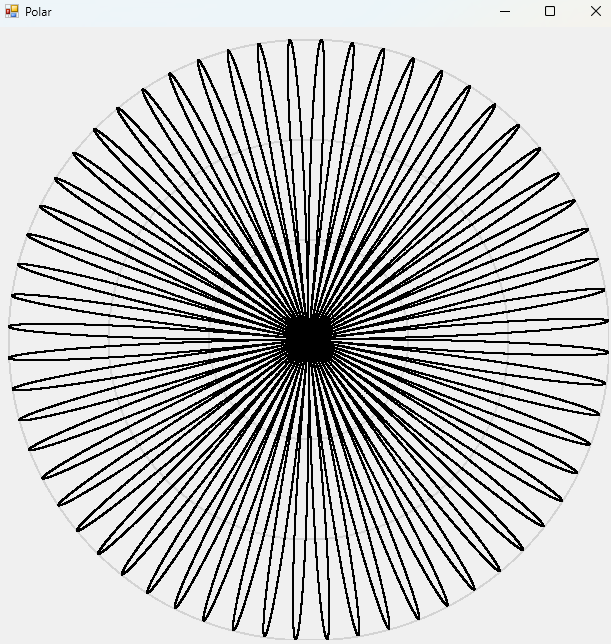

# Polar Plot

## Description
A program that plots in polar coordinates. I wrote the program in 2015 when I was learning C# and polar coordinates in high school.

## Requirements
An installation of Microsoft .NET redistributable is probably required to run.

Microsoft Visual Studio with C# components installed is required for compilation if you want to edit the expression.

## Quick Start
Run `Polar\bin\Debug\Polar.exe` to see the plot of the demo expression.

## Editing the expression
1. Open Microsoft Visual Studio
2. Open the Solution, `Polar.sln`
3. Edit the `Polar\Form1.cs` file:
    1. To change the boundaries for plotting, edit the loop conditions on line 34
    2. To change the function expression, edit the loop's body
4. Run the program using the debug button.
